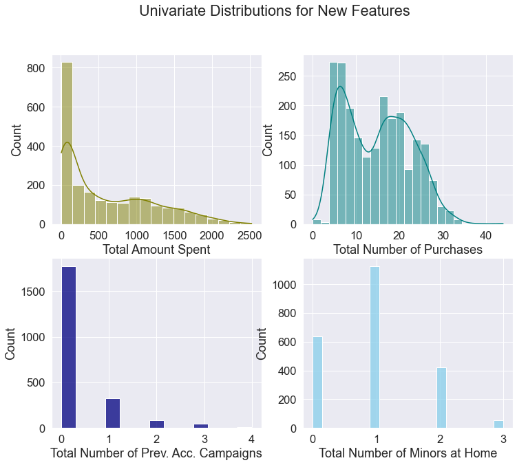

 

# Marketing Campaign
* Built a classification model with 81% accuracy and an F1-score of 0.47 on the test data to predict customer acceptance of a marketing campaign.
* Identifying customers who are more likely to accept the campaign will assist companies in using their marketing resources more effectively, increasing overall profit.
* Cleaned and conducted data exploration on 2,240 observations and 29 columns (2 categorical, 1 date type, and the remaining 26 numerical) from https://www.kaggle.com/rodsaldanha/arketing-campaign.
* Compared model performance on a standardized original dataset and a standardized dataset that was balanced using Synthetic Minority Oversampling Technique (SMOTE) and Random Undersampling. 
* Used GridSearchCV to identify the best parameters on seven different classification models.
* Compared nine different classification metrics, including an engineered profit metric. 
* The two best models were selected and evalauted on the set aside test data. Results indicate the **Random Forest Classifier** produced the best overall metrics, including the highest profit score.

## Code and Resources Used
**Packages:** numpy, pandas, seaborn, matplotlib, sklearn

## Data Cleaning and Preprocessing
Data included 2,240 observations and 29 columns.
* Examined missing values and addressed 24 missing income values using scikit-learn's Iterative Imputer function.
* Examined distribution of categorical and numeric variables; removed one income outlier.
* Engineered features, including re-binning marital status into two categorices and aggregating total amount spent, total number of purchases, total number of minors in the home, and total number of campaigns previously accepted.
* Split data into training, validation, and testing sets.
* Standardized data using scikit learn's StandardScalar() function.

## Model Building  
Compared model performance on two datasets: 
1. Standardized dataset
2. Standardized dataset that used Synthetic Minority Oversampling Technique (SMOTE) and Random Undersampling to address class imbalance.

Used GridSearchCV on the following models to determine the best parameters: 
* Logistic Regression
* Support Vector Machines
* K Nearest Neighbors
* Decision Tree
* Random Forest
* Adaboost
* Gradient Boosting

## Model Performance

Used the following evaluation metrics:
* Training accuracy
* Validation accuracy
* Recall
* Specificity
* Precision
* Balanced Accuracy
* F1 score
* Difference between training and validation accuracy
* Profit

The dataset indicated that each contact cost the company \$3, and each campaign acceptance produced a revenue of \$11. Using this data, we calculated the following profit evaluation metric:  

Profit = (True positives x \$11 revenue) - (False positives x \$3 cost) - (False negatives x \$11 lost revenue)

## Results

Using profit as the main evaluator, the **Random Forest Classifier** and the **Logistic Regression Classifier** were chosen as the two best models. These two models were evaluated on the set aside test data. Results indicate the **Random Forest Classifier** produced the best overall metrics, including the highest profit score.

### [Link to Project GitHub Repository](https://github.com/chelseako/marketing_campaign)

### [Back to Chelsea Ko's Portfolio](https://chelseako.github.io/Portfolio/)
